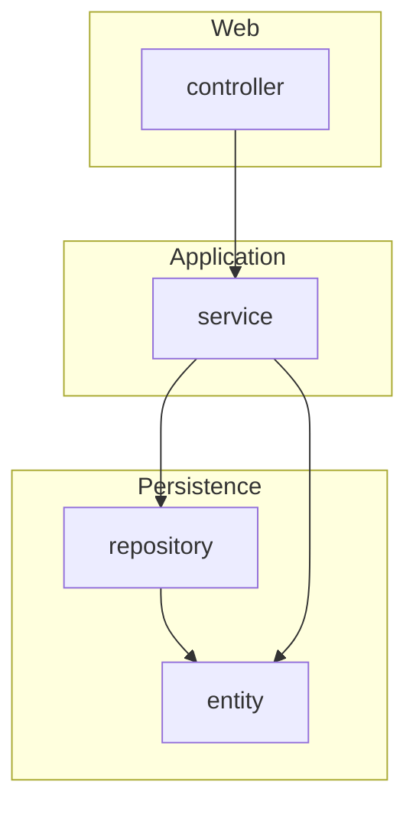

# Spring Boot + ArchUnit — Architecture Testing Example

A small **Spring Boot** application that uses **[ArchUnit](https://www.archunit.org/)** to encode layered architecture and naming conventions as **automated JUnit tests**. Run `./gradlew test` and your build fails if someone breaks the agreed structure—no extra tooling or manual reviews required.

---

## Why ArchUnit?

| Without ArchUnit | With ArchUnit |
|------------------|---------------|
| “Don’t call the controller from the repository” lives in docs or code review | **Executable rules** that run on every CI build |
| Drift happens slowly as teams add shortcuts | **Fast feedback** when dependencies or packages violate policy |
| Onboarding relies on tribal knowledge | **Living documentation** of what “allowed” means in this codebase |

ArchUnit analyzes **compiled bytecode** (not source text), so it sees real dependencies between types—including Spring proxies and what your code actually references.

---

## What this repository demonstrates

- **Layered architecture** — Controller → Service → Repository, with rules on who may call whom.
- **Package-level rules** — Controllers under `..controller..`, services named `*Service` / `*ServiceImpl`, repositories as Spring Data interfaces, and more.
- **Spring-friendly conventions** — Prefer constructor injection; no `@Autowired` on fields in production code.
- **JUnit 5 + Gradle** — Same test task you already run; **JaCoCo** reports are generated after tests.
- **Integration tests** — `MockMvc` exercises the REST API alongside static architecture checks.

---

## Tech stack

| | Version / notes |
|---|------------------|
| Java | 21 |
| Spring Boot | 4.0.x |
| Build | Gradle 8.x (wrapper included) |
| ArchUnit | `archunit-junit5` **1.4.1** (Java 21+ bytecode support) |
| Coverage | JaCoCo |

---

## Quick start

```bash
git clone <your-fork-or-repo-url>
cd springboot-archunit-example
./gradlew bootRun
```

API base path: `/rest/api/customer` (CRUD-style customer resource).

Run the full test suite (including ArchUnit):

```bash
./gradlew test
```

Generate a **code coverage** report (HTML + XML):

```bash
./gradlew jacocoTestReport
# Open: build/reports/jacoco/test/html/index.html
```

---

## Coordinates and base package

- **Gradle `group`** (Maven coordinates): **`com.avarna`** — see `build.gradle`.
- **Java base package** (imports, `package` lines, ArchUnit `BASE_PACKAGE`): **`com.avarna.customer`** — matches the `com/avarna/...` source tree and what JaCoCo reports under **Package**.

---

## Project layout (layered packages)

Production code is organized by **layer** under one base package (logical structure):

```text
com.avarna.customer
├── CustomerApplication
├── controller/          # REST adapters
├── service/             # Application / use-case logic
├── repository/          # Spring Data JPA
├── entity/              # JPA entities
├── domain/              # Domain models (DTOs / core types exposed to API)
├── config/              # Spring @Configuration
└── exception/           # @RestControllerAdvice, API errors
```

ArchUnit imports **`com.avarna.customer`** (excluding tests) and evaluates rules against those classes.



---

## How ArchUnit is wired in this project

### 1. Import production classes once

Rules share a single `JavaClasses` instance built with `ClassFileImporter`:

- **Base package:** `com.avarna.customer`
- **Tests excluded:** `ImportOption.Predefined.DO_NOT_INCLUDE_TESTS`
- The static field is named **`productionClasses`** (not `classes`) so it does **not** shadow `ArchRuleDefinition.classes()` in the fluent API.

### 2. Use full package identifiers for layers

Patterns like `..controller..` often **do not** match a *leaf* package such as `com.example.app.controller` (nothing after `controller`). This project uses explicit identifiers, for example:

- `com.avarna.customer.controller..`
- `com.avarna.customer.service..`
- `com.avarna.customer.repository..`

Those feed both **`layeredArchitecture().definedBy(...)`** and **`resideInAPackage(...)`** in component tests.

### 3. Where the rules live

| Location | Purpose |
|----------|---------|
| [`ArchitectureTest`](src/test/java/com/avarna/customer/ArchitectureTest.java) | Cross-cutting rules: layers, naming interfaces, no field `@Autowired`, services/repos must not depend on web types |
| [`ControllerComponentTest`](src/test/java/com/avarna/customer/ControllerComponentTest.java) | REST controller naming, `@RestController`, package placement |
| [`ServiceComponentTest`](src/test/java/com/avarna/customer/ServiceComponentTest.java) | `@Service` on concrete classes, naming, access from controllers |
| [`RepositoryComponentTest`](src/test/java/com/avarna/customer/RepositoryComponentTest.java) | Spring Data repositories, naming, access from services |
| [`DomainComponentTest`](src/test/java/com/avarna/customer/DomainComponentTest.java) | Domain model visibility and dependencies (incl. Lombok) |
| [`EntityComponentTest`](src/test/java/com/avarna/customer/EntityComponentTest.java) | JPA entities: `@Entity`, serialization, allowed dependencies |

Subclass tests **inherit** the shared `ArchitectureTest` rules, so the global architecture is checked from multiple test classes without duplicating imports.

---

## Example rules (high level)

| Rule | Intent |
|------|--------|
| **Layered architecture** | Controller / Service / Repository layers with allowed dependencies only |
| **No `*Interface` suffix** on interfaces | Avoid redundant `FooInterface` naming |
| **No `@Autowired` on fields** | Prefer constructor injection (aligns with Lombok `@RequiredArgsConstructor` / explicit constructors) |
| **Services & repositories** | Must not depend on types in the **controller** package |
| **Per-layer tests** | Naming, annotations (`@RestController`, `@Service`, `@Repository`), and package placement |

When a rule fails, ArchUnit prints **which dependency or class** violated it—fix the code or discuss changing the rule explicitly.

---

## Tips for your own project

1. **Match ArchUnit to your JDK** — If you compile with a **newer** Java than your ArchUnit version supports, bytecode import can fail silently or with ASM errors. Prefer a recent **`archunit-junit5`** release.
2. **Keep one `JavaClasses` import** per rule set to avoid scanning the classpath repeatedly.
3. **Treat rules as code** — When you intentionally change architecture, update the ArchUnit tests in the same PR.
4. **Start small** — Begin with layered boundaries and forbidden dependencies; add naming and annotation rules as the team agrees on them.

---

## Useful links

- [ArchUnit — official site](https://www.archunit.org/)
- [User guide](https://www.archunit.org/userguide/html/000_Index.html)
- [JUnit 5 support (`archunit-junit5`)](https://github.com/TNG/ArchUnit/tree/main/archunit-junit5)
- [Spring Boot](https://spring.io/projects/spring-boot)

---

## License

This project is released under the [MIT License](LICENSE).

---

<p align="center">
  <sub>Built as a public example of <strong>architecture-as-tests</strong> with Spring Boot and ArchUnit.</sub>
</p>
